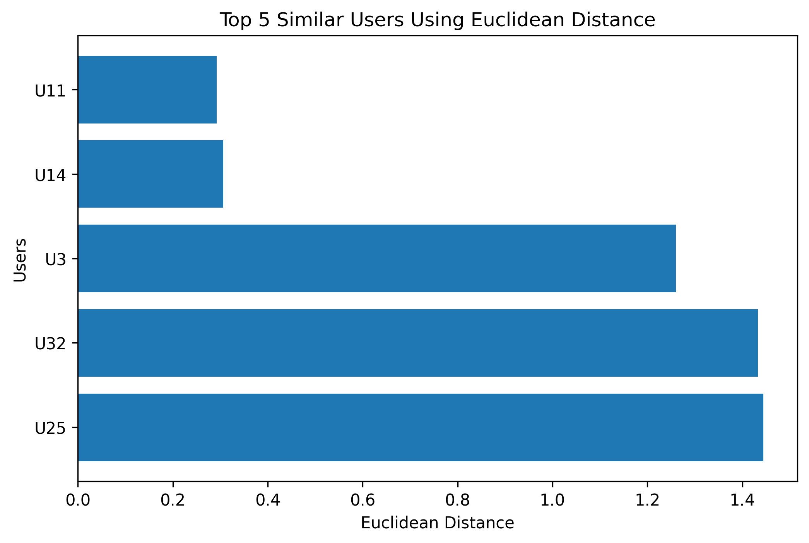
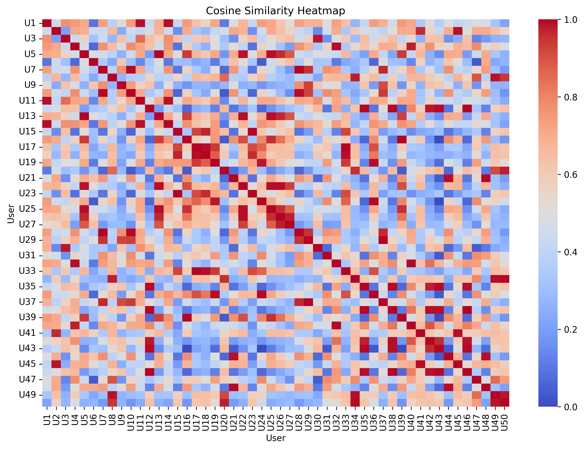

# Music Preference Matching Using Similarity Metrics

This project explores how different similarity metrics influence recommendation behavior in a music preference matching scenario. The analysis focuses on understanding how feature representation, scaling, and vector similarity affect recommendation outcomes.


---

## Similarity Metrics Explored

This project explores multiple similarity approaches for recommendation systems:

- Manhattan Distance
- Euclidean Distance
- Cosine Similarity

The experiments demonstrate how different similarity metrics produce different recommendation behaviors and interpretations.

## Project Objectives

- Understand the fundamentals of Manhattan Distance
- Explore similarity analysis between users
- Apply feature engineering techniques
- Implement scaling and normalization
- Experiment with weighted distance calculations
- Analyze how preprocessing affects recommendation outcomes

---

## Dataset

This project uses a **synthetic dataset** containing music-related attributes such as:

- Tempo
- Energy
- Acousticness
- Danceability
- Genre
- Mood

The dataset is designed for educational purposes to simulate user music preferences.

---

## Key Concepts

- Manhattan Distance
- Euclidean Distance
- Cosine Similarity
- Feature Engineering
- One-Hot Encoding
- Feature Scaling
- Pairwise Similarity Analysis
- Heatmap Visualization
- Recommendation Systems

---
## Project Files

- `Music_Preference_Matching_Using_Manhattan_Distance.ipynb`
- `Comparative_Similarity_Analysis.ipynb`
- `music_preferences.csv`

---

## Key Insights

Several important observations were discovered during the analysis:

- Numerical features can dominate similarity calculations.
- Scaling helps create fairer feature contributions.
- Weighted distance allows domain knowledge to influence recommendations.
- Recommendation systems are highly dependent on feature representation and modeling assumptions.

---

## Tools & Libraries

- Python
- Pandas
- NumPy
- Jupyter Notebook
---

## Euclidean Distance Visualization
The following visualization shows the Top 5 most similar users using Euclidean Distance after Min-Max Scaling.


---
## Cosine Similarity Heatmap

The following heatmap visualizes pairwise cosine similarity relationships between users based on their music preference vectors.




## Future Improvements

- Cosine Similarity
- K-Nearest Neighbors (KNN)
- Context-Aware Recommendation Systems
- Real-world Spotify datasets
- User clustering and visualization

---
## Repository Structure

- `Music_Preference_Matching_Using_Manhattan_Distance.ipynb`
- `Comparative_Similarity_Analysis.ipynb`
- `Cosine_Similarity_for_Music_Preference_Matching.ipynb`
- `music_preferences.csv`

## Repository Structure

```bash
music-preference-matching/
│
├── Music_Preference_Matching_Using_Manhattan_Distance.ipynb
├── README.md
```

---

## Author

Created as part of a learning journey in:
- Data Mining
- Recommendation Systems
- Similarity Analysis
- Machine Learning Fundamentals
